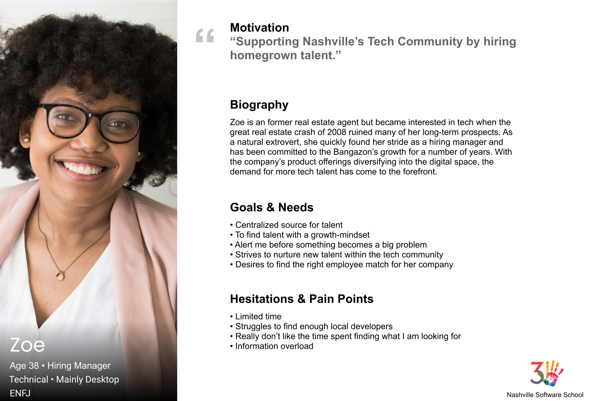
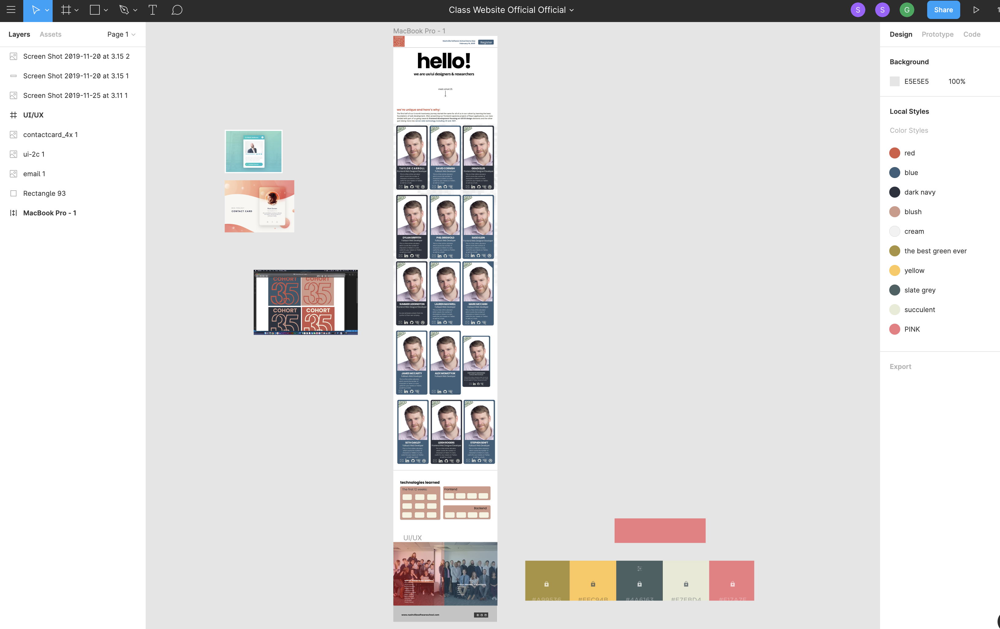

# Welcome to the Nashville Software School's Cohort 35 Website

*View at https://nss-day-cohort-35.github.io/*

## Project Overview
Each cohort at NSS has a class website for potential employers to view student accomplishments prior to Demo Day. As the UX/UI half of Cohort 35 we used our class website as a protype to showcase our abilities in the design and implementation process of user design. We bypassed the cookie cutter template that past cohorts have used and started from scratch by:
+ defining our user
+ understanding their pain points
+ creating a new website layout
+ condensing copy and information
+ observing user testing

## Challenge Statement
How might we promote Demo Day and showcase Cohort 35’s dual skill sets to potential employers with the ultimate goal of employment?

## Personas

## Wireframes and Mockups

We researched color palettes on websites such as:

+ https://coolors.co/
+ https://color.adobe.com/create
+ http://colormind.io/

The UI/UX class narrowed down our options to 2 color palettes. We felt the colors in the palettes we chose were both muted and modern. We then sent the 2 palettes choices in a poll to the full stack side of the cohort to vote on. Once the votes were in, we used the agreed upon colors for the website.

We used Figma to prototype the Website:

## User Testing
For our research we interviewed our career services and placement team here at Nashville Software School.

We also connected with local external graphic designers and senior web developers in the industry for informal feedback before finalizing our project.

## Lessons Learned

+ Observing user testing throughout the creation of a project can help keep focus on areas that are important to the end user.
+ Referring to the defined user can help guide decision making.

## To Install
In the project directory, run:
`npm install`

Followed by:

`npm start`
Runs the app in the development mode.

Open http://localhost:3000 to view it in the browser.

The page will reload if you make edits.
You will also see any lint errors in the console.

Built and designed by Cohort 35 UX/UI students: Taylor Carroll, Gradi Ellis, Sage Klein, Summer Liddington, Leigh Rogers, Quin Smith, and Chandler Turner.